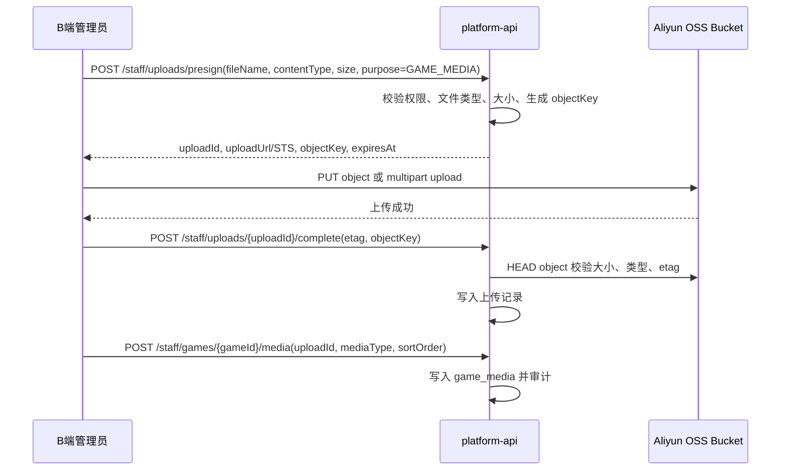

# 前端页面到接口契约映射

## 目的

本文档从已实现的 C 端/B 端页面原型反推接口和 DTO，作为 `resources/docs/api/openapi-v1.yaml` 的阅读入口。

## C 端页面

### C 端接口拆分原则

- 页面上同时存在多个独立业务区块时，不用一个大接口硬塞；按区块拆接口，便于 Mock、缓存、埋点和后续推荐算法替换。
- 搜索页至少拆成“筛选项接口”和“搜索结果接口”。顶部搜索栏只负责路由跳转，真正查询由 `/search` 页面触发。
- 用户动作接口和页面初始化接口分开记录，例如加入购物车、创建订单、模拟支付、创建客服会话。
- C 端只能访问当前登录用户自己的订单、权益、购物车和会话；未登录首页推荐可以返回默认推荐。

### 页面初始化接口

| 页面 | 初始化时需要的数据 | OpenAPI | 说明 |
| --- | --- | --- | --- |
| `/` 首页 | 用户推荐游戏 | `GET /home/recommended-games?scene=homepage&limit=...` | 根据用户行为推荐；未登录返回默认推荐。 |
| `/` 首页 | 精选游戏 | `GET /home/featured-games?limit=...` | 运营精选，不依赖搜索条件。 |
| `/` 首页 | 过去 24h 销量榜 | `GET /home/sales-ranking?window=24h&limit=...` | 首页右侧榜单。 |
| `/search` 搜索页 | 筛选项 | `GET /search/game-filters` | 平台、购买方式、价格区间、排序项。 |
| `/search` 搜索页 | 搜索结果 | `GET /search/games?q=...&platform=...&purchaseMethod=...&priceMin=...&priceMax=...&limit=...&cursor=...` | 用户从顶部搜索栏跳转后，由搜索页发起。 |
| `/games/:id` 游戏详情 | 游戏详情 | `GET /games/{gameId}` | 媒体、游戏版本、可售方案、价格、退款规则、客服入口标记。 |
| `/games/:id` 游戏详情 | 相关游戏推荐 | `GET /games/{gameId}/related?limit=...` | 详情页底部或侧栏推荐。 |
| `/deals` 优惠页 | 优惠游戏列表 | `GET /deals/games?limit=...&cursor=...` | 当前只做优惠列表；后续需要筛选时可复用搜索筛选项或新增优惠筛选项。 |
| `/flash-sale` 限时秒杀 | 当前秒杀场次 | `GET /flash-sales/current` | 包含场次时间、倒计时所需时间字段和秒杀商品。 |
| `/cart` 购物车 | 购物车条目与总价 | `GET /cart` | 页面初始化加载当前用户购物车。 |
| `/orders` 订单列表 | 订单摘要列表 | `GET /orders?status=...&limit=...&cursor=...` | 支持按订单状态筛选。 |
| `/orders/:id` 订单详情 | 订单详情、订单项、权益 | `GET /orders/{orderId}` | 用于查看交付结果、售后入口。 |
| `/support` 客服入口 | 问题类型 | `GET /support/issue-types` | 例如 CDK 无效、礼物领取失败、退款咨询。 |
| `/support` 客服入口 | 最近订单/权益/未关闭会话 | `GET /support/context` | 用于让用户选择本次咨询关联对象。 |
| `/support/sessions/:id` 会话页 | 会话详情 | `GET /support/sessions/{sessionId}` | 包含会话状态、关联订单/权益和上下文。 |
| `/support/sessions/:id` 会话页 | 会话消息 | `GET /support/sessions/{sessionId}/messages?afterSequence=...` | 初次进入和重连补拉都用该接口。 |
| `/profile` 个人信息 | 当前用户信息 | `GET /me` | 用户名、昵称、头像、账号状态。 |
| `/profile` 个人信息 | 我的数字权益 | `GET /entitlements?status=...&limit=...&cursor=...` | 可作为个人中心中的“我的游戏/权益”模块。 |
| `/categories` 分类页 | 暂不开发 | 暂无 | 导航占位。 |
| `/announcements` 公告页 | 暂不开发 | 暂无 | 导航占位。 |

### 用户操作触发接口

| 触发位置 | 用户动作 | OpenAPI | 说明 |
| --- | --- | --- | --- |
| 顶部搜索栏 | 输入关键词并回车/点击搜索 | 无直接 API，路由到 `/search?q=关键词` | 搜索页读取 query string 后调用 `GET /search/game-filters` 和 `GET /search/games`。 |
| `/search` | 修改筛选项、排序、分页 | `GET /search/games` | 每次筛选变化重新请求结果；分页使用 cursor。 |
| 游戏卡片 | 点击游戏 | 无直接 API，路由到 `/games/{gameId}` | 详情页再调用 `GET /games/{gameId}`。 |
| `/games/:id`、`/flash-sale` | 加入购物车 | `POST /cart/items` | 需要 `Idempotency-Key`，避免重复点击生成重复条目。 |
| `/cart` | 修改数量 | `PATCH /cart/items/{cartItemId}` | 修改后返回最新购物车。 |
| `/cart` | 删除商品 | `DELETE /cart/items/{cartItemId}` | 删除成功返回 204。 |
| `/cart` | 提交订单 | `POST /orders` | 从购物车或立即购买创建订单。 |
| `/orders/:id` 或支付页 | 演示支付 | `POST /orders/{orderId}/mock-payment` | 仅演示环境使用，模拟支付成功并触发数字权益交付。 |
| `/orders/:id` | 针对订单发起客服 | `POST /support/sessions` | request body 携带 `orderId`。 |
| `/orders/:id` 或权益模块 | 针对权益发起客服 | `POST /support/sessions` | request body 携带 `entitlementId`。 |
| `/support` | 创建客服会话 | `POST /support/sessions` | 创建后跳转 `/support/sessions/{sessionId}`。 |
| `/support/sessions/:id` | 发送消息 | `POST /support/sessions/{sessionId}/messages` | 需要 `messageKey` 和 `Idempotency-Key`。 |

## B 端页面

### B 端菜单分类

B 端左侧菜单按业务域分类，不再按“客服功能/管理员功能”粗分：

| 分类 | 子菜单 | 路由 |
| --- | --- | --- |
| 会话管理 | 待接待会话、已接待会话 | `/conversations/pending`、`/conversations/accepted` |
| 工单管理 | 待处理工单、已处理工单 | `/tickets/pending`、`/tickets/resolved` |
| 游戏管理 | 上架/下架游戏、首页精选游戏、限时秒杀 | `/games`、`/games/featured`、`/games/flash-sales` |
| 业务管理 | 退款审核、CDK/礼物补发、账号处置、知识库配置、审计日志 | `/refunds`、`/entitlements`、`/account-actions`、`/knowledge`、`/audit-logs` |
| 用户管理 | 客服管理、角色权限 | `/agents`、`/roles` |

### B 端页面初始化接口

| 分类 | 页面 | 初始化时需要的数据 | OpenAPI | 说明 |
| --- | --- | --- | --- | --- |
| 会话管理 | `/conversations/pending` | 待接待会话列表 | `GET /staff/conversations/pending?limit=...&cursor=...` | 客服接入排队用户。 |
| 会话管理 | `/conversations/accepted` | 已接待/历史会话列表 | `GET /staff/conversations/accepted?staffId=...&limit=...&cursor=...` | 默认看当前客服，也允许管理员按客服筛选。 |
| 会话管理 | `/conversations/:id` | 会话详情、消息、订单/权益上下文、Agent 建议 | `GET /staff/conversations/{sessionId}` | 详情保留，列表点击进入。 |
| 工单管理 | `/tickets/pending` | 待处理工单列表 | `GET /staff/tickets/pending?limit=...&cursor=...` | 管理员处理退款、补发、账号处置等工单。 |
| 工单管理 | `/tickets/resolved` | 已处理工单列表 | `GET /staff/tickets/resolved?limit=...&cursor=...` | 查看已解决、已关闭、已驳回工单。 |
| 工单管理 | `/tickets/:id` | 工单详情、处理历史、关联会话/订单/权益 | `GET /staff/tickets/{ticketId}` | 详情保留，所有高风险动作从详情进入。 |
| 游戏管理 | `/games` | 游戏商品、版本、购买方式、可售方案、库存/权益、上下架状态 | `GET /staff/games?status=...&limit=...&cursor=...` | 对应“上架/下架游戏”。 |
| 游戏管理 | `/games/featured` | 首页精选游戏配置 | `GET /staff/home-featured-games` | 配置 C 端首页精选区。 |
| 游戏管理 | `/games/flash-sales` | 限时秒杀场次列表 | `GET /staff/flash-sales?status=...&limit=...&cursor=...` | 配置 C 端秒杀页和活动场次。 |
| 业务管理 | `/refunds` | 退款审核记录 | `GET /staff/refunds?status=...&limit=...&cursor=...` | 实际审核动作仍建议从工单详情执行。 |
| 业务管理 | `/entitlements` | 数字权益、CDK、礼物补发视图 | `GET /staff/entitlements?status=...&q=...&limit=...&cursor=...` | 聚合查看交付状态，补发动作通过工单或权益详情执行。 |
| 业务管理 | `/account-actions` | 账号冻结、解冻、注销等处置记录 | `GET /staff/account-actions?action=...&limit=...&cursor=...` | 高风险操作需要二次确认和审计。 |
| 业务管理 | `/knowledge` | 知识库空间、文档数量、发布状态 | `GET /staff/knowledge-bases?limit=...&cursor=...` | 管理员配置知识库，客服只读命中内容。 |
| 业务管理 | `/audit-logs` | 操作审计日志 | `GET /staff/audit-logs?actor=...&resourceType=...&limit=...&cursor=...` | 追踪退款、补发、账号、权限、游戏配置等操作。 |
| 用户管理 | `/agents` | 客服列表、在线状态、接待量、满意度 | `GET /staff/support-agents?status=...&limit=...&cursor=...` | 管理客服账号和状态。 |
| 用户管理 | `/roles` | 角色模块权限矩阵 | `GET /staff/roles/module-permissions` | 超级管理员配置模块显示和功能入口。 |

### B 端用户操作触发接口

| 分类 | 触发位置 | 用户动作 | OpenAPI | 说明 |
| --- | --- | --- | --- | --- |
| 会话管理 | `/conversations/pending` | 接入会话 | `POST /staff/conversations/{sessionId}/accept` | 需要 `Idempotency-Key`，避免重复接入。 |
| 会话管理 | `/conversations/:id` | 客服发送消息 | `POST /staff/conversations/{sessionId}/messages` | 与 C 端消息格式保持一致。 |
| 会话管理 | `/conversations/:id` | 升级为工单 | `POST /staff/tickets` | request body 携带 `conversationId`、`orderId`、`entitlementId`。 |
| 工单管理 | `/tickets/:id` | 开始处理、退款通过/驳回、补发、账号冻结/解冻、关闭 | `POST /staff/tickets/{ticketId}/transition` | 统一工单状态机入口，要求 `expectedVersion` 和处理原因。 |
| 游戏管理 | `/games` | 新建游戏草稿 | `POST /staff/games` | 创建后进入游戏编辑页。 |
| 游戏管理 | `/games` 或游戏编辑页 | 编辑游戏基础信息、版本、购买方式、可售方案价格、库存和交付配置 | `PATCH /staff/games/{gameId}` | 携带 `expectedVersion`。 |
| 游戏管理 | `/games` | 上架/下架游戏 | `PATCH /staff/games/{gameId}/publish-status` | 高影响操作，需要原因和审计。 |
| 游戏管理 | 游戏编辑页 | 申请图片上传凭证 | `POST /staff/uploads/presign` | 用于封面、截图、详情图；返回 OSS 直传地址或 STS 临时凭证。 |
| 游戏管理 | 游戏编辑页 | 浏览器直传图片到阿里云 OSS | 直传 OSS，不经过平台 API | 前端使用后端签发的 `uploadUrl` 或 STS 凭证上传。 |
| 游戏管理 | 游戏编辑页 | 确认上传完成并绑定游戏媒体 | `POST /staff/uploads/{uploadId}/complete`、`POST /staff/games/{gameId}/media` | 后端校验对象、记录 `game_media`，再展示到 C 端。 |
| 游戏管理 | 游戏编辑页 | 删除或调整游戏图片 | `DELETE /staff/games/{gameId}/media/{mediaId}`、`PUT /staff/games/{gameId}/media/sort-order` | 删除是解除业务绑定；OSS 对象清理由异步任务或保留策略处理。 |
| 游戏管理 | `/games/featured` | 保存首页精选游戏配置 | `PUT /staff/home-featured-games` | 配置排序、生效时间、展示开关。 |
| 游戏管理 | `/games/flash-sales` | 创建秒杀场次 | `POST /staff/flash-sales` | 配置时间、可售方案 `offerId`、秒杀价格、活动库存。 |
| 游戏管理 | `/games/flash-sales` | 发布、暂停、结束秒杀 | `PATCH /staff/flash-sales/{flashSaleId}/publish-status` | 秒杀状态变化需要审计。 |
| 业务管理 | `/knowledge` | 新建知识库 | `POST /staff/knowledge-bases` | 管理员操作。 |
| 业务管理 | `/knowledge` | 新增知识文档 | `POST /staff/knowledge-bases/{knowledgeBaseId}/documents` | 可先支持 Markdown/FAQ，后续扩展文件上传解析。 |
| 用户管理 | `/agents` | 启用/禁用客服、调整在线状态 | `PATCH /staff/support-agents/{staffId}/status` | 管理员操作，写审计。 |
| 用户管理 | `/roles` | 保存角色模块权限 | `PUT /staff/roles/module-permissions` | 超级管理员操作，要求 `expectedVersion`。 |

### 游戏图片上传设计

管理员配置游戏图片时采用“后端签名、前端直传阿里云 OSS、后端确认绑定”的方式。

设计约束：

- 阿里云侧建议使用 OSS Bucket；“容器”如果指的是其他云产品，需要后续明确。
- 不把 AccessKey 暴露给前端；前端只拿短期 `uploadUrl` 或 STS 临时凭证。
- Bucket 默认私有，图片展示通过 CDN 域名、签名 URL 或后端生成的可访问 URL。
- 后端限制 `image/webp`、`image/jpeg`、`image/png`，并限制单文件大小和图片数量。
- objectKey 使用租户和业务前缀，例如 `tenant/{tenantId}/games/{gameId}/media/{ulid}.webp`。
- 上传完成后必须 `complete` 校验，不能只相信前端返回。
- 删除游戏图片优先解除业务绑定；OSS 物理删除可通过异步任务或生命周期策略处理。

## DTO 分层

### 列表摘要 DTO

列表页面使用轻 DTO，避免一次性拉取详情：

- `GameSummary`
- `GameSummaryList`
- `GameRankingItem`
- `GameRankingList`
- `GameSearchFilters`
- `Cart`
- `CartItem`
- `OrderSummary`
- `Entitlement`
- `SupportSession`
- `CustomerProfile`
- `StaffConversationSummary`
- `TicketSummary`
- `GameAdminItem`
- `EntitlementAdminItem`
- `RefundReviewSummary`
- `AccountActionSummary`
- `KnowledgeBaseItem`
- `AuditLogItem`
- `AgentCallLogItem`
- `UploadPresignResult`
- `UploadedAsset`

### 详情 DTO

详情页使用聚合 DTO，包含当前页面需要的上下文：

- `GameDetail`
- `OrderDetail`
- `SupportContext`
- `SupportSessionDetail`
- `StaffConversationDetail`
- `TicketDetail`
- `GameMediaAdminItem`

### 命令 DTO

状态变化、发消息、建会话、购物车、下单、上下架必须使用命令 DTO，并携带幂等键或版本：

- `AddCartItemRequest`
- `UpdateCartItemRequest`
- `CreateOrderRequest`
- `MockPaymentRequest`
- `CreateSupportSessionRequest`
- `CreateSupportMessageRequest`
- `TicketTransitionRequest`
- `CreateGameDraftRequest`
- `UpdateGamePublishStatusRequest`
- `CreateKnowledgeBaseRequest`
- `CreateUploadPresignRequest`
- `CompleteUploadRequest`
- `BindGameMediaRequest`
- `SaveGameMediaSortOrderRequest`

## 设计边界

- C 端只能访问本人订单、本人权益和本人会话。
- B 端客服只能处理会话和升级工单，不能直接执行退款、补发、账号处置。
- B 端管理员可以处理工单、游戏管理、退款、补发、账号处置。
- 超级管理员配置模块权限，但模块可见性不等同于高风险动作授权。

