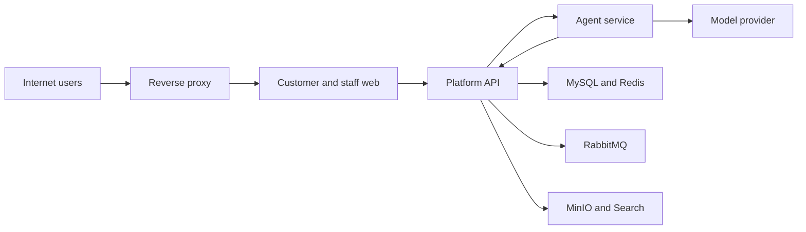

# AICareDesk 威胁模型

## Executive summary

AICareDesk 首版将以单机形式部署到公网供作品演示，使用虚构游戏数字商品、订单、CDK、礼物、会话和工单数据，以及平台自有账号。最高风险不是演示数据本身的泄露，而是公网入口被利用后发生跨账号越权、管理员或知识库权限被接管、恶意文件处理、Agent 被提示注入后滥用 Java 工具，以及资源耗尽导致演示不可用。当前仓库处于设计基线阶段，因此下文“现有控制”表示已批准、后续必须由代码和配置落实的设计控制，不代表已经通过实现验证。

## Scope and assumptions

- 范围：`customer-web`、`staff-web`、统一反向代理入口、`platform-api`、`agent-service`、模型服务，以及 MySQL、Redis、RabbitMQ、MinIO、Elasticsearch 的运行时边界；系统组成证据见 `resources/docs/architecture/context-and-containers.md`。
- 运行方式：四个应用后续容器化，单台 Linux 虚拟机承载可复现公网演示；该环境不具备多节点高可用能力，证据见 `resources/docs/adr/0003-local-development-topology.md`。
- 数据：只使用虚构的游戏商品、订单、数字权益、CDK、礼物、会话和工单数据，不处理真实支付、真实平台账号、真实 CDK 库存或真实客户资料。
- 身份：首版使用平台自有账号和 JWT，不接企业 SSO；消费者与员工共用身份边界，但客服、管理员、超级管理员的模块权限和资源作用域不同，证据见 `resources/docs/security/access-control-matrix.md`。
- 租户：运行时只有一个企业租户，所有核心数据、缓存键、对象路径和事件仍必须携带 `tenant_id`，为越权测试和后续扩展保留真实隔离语义。
- Agent：Java 持有业务真相与写权限；Agent 只能调用最小化、重新授权的 Java 工具，浏览器不能直连 Agent，证据见 `resources/docs/architecture/module-boundaries.md`。
- CI、开发机、测试数据生成器不属于本次运行时攻击面；依赖与发布链风险仍作为单独威胁保留，因为其可改变公网制品。

会显著改变评级的复核项：接入真实客户数据、开放公众自助注册、引入真实支付、真实游戏平台/CDK 供应链写操作、拆分为多企业共享运行环境，均需重新执行威胁建模。

## System model

### Primary components

| 区域 | 组件 | 安全责任 | Evidence anchor |
|---|---|---|---|
| 公网客户端 | customer-web、staff-web | 展示与输入采集，不决定资源权限，不保存业务真相 | `resources/docs/architecture/context-and-containers.md`“容器职责” |
| 公网边界 | 反向代理 | TLS 终止、请求大小限制、基础限流、安全响应头，只暴露必要端口 | `resources/docs/architecture/context-and-containers.md`“部署视图” |
| 可信业务区 | platform-api | JWT 验证、RBAC/BOLA 校验、状态机、事务、审计、Agent 工具授权 | `resources/docs/api/api-standards.md`“身份与租户”；`resources/docs/security/access-control-matrix.md` |
| 受限 AI 区 | agent-service、模型服务 | 处理提示与检索结果，只产生回答、摘要、草稿和建议 | `resources/docs/api/api-standards.md`“AgentGateway 契约” |
| 数据与消息区 | MySQL、Redis、RabbitMQ、MinIO、Elasticsearch | 分别承载业务真相、缓存、事件、二进制对象和可重建搜索投影 | `resources/docs/data/core-data-model.md`；`resources/docs/api/event-contracts.md` |

### Data flows and trust boundaries

- Internet → 反向代理：JWT、Cookie、JSON、WebSocket 帧和上传文件经 HTTPS/WSS 进入；要求 TLS、严格来源策略、请求大小与速率限制，文件内容不能仅信任扩展名。
- 反向代理 → platform-api：转发已限制大小的 HTTP/WebSocket 流量；API 必须自行验证 JWT、主体、租户、资源归属、状态与幂等键，不信任客户端或代理提供的业务身份字段。
- platform-api → MySQL/Redis/RabbitMQ：传输事务记录、租户化缓存与版本化事件；要求私网访问、独立凭据、最小权限、参数化查询、租户化键和 outbox/消费幂等，证据见 `resources/docs/api/event-contracts.md`。
- platform-api → MinIO/Elasticsearch：传输上传对象、对象元数据、知识内容和搜索投影；要求对象归属校验、不可预测对象键、解析隔离、索引租户过滤，业务真相仍在 MySQL。
- platform-api → agent-service：经版本化 HTTPS 传输委托主体、租户、会话、最少必要业务上下文和 correlationId；要求服务身份、15 秒超时、响应 Schema 校验和可预测降级，证据见 `resources/docs/api/api-standards.md`。
- agent-service → 模型服务：传输系统提示、经过裁剪的会话和检索片段；要求密钥隔离、出站域名白名单、敏感字段最小化、超时与调用限额。
- agent-service → platform-api 工具接口：传输工具名、参数和原始委托上下文；Java 对每次调用重新执行 RBAC、资源归属、状态机与幂等校验，高风险结果只能形成草稿，证据见 `resources/docs/security/access-control-matrix.md`“Agent 委托”。

#### Diagram

## Assets and security objectives

| Asset | Why it matters | Security objective (C/I/A) |
|---|---|---|
| 账号密码哈希、JWT 签名密钥、模型密钥、服务凭据 | 泄露后可导致身份伪造、管理面接管或外部模型费用损失 | C/I |
| 角色、模块权限、租户和资源归属 | 决定消费者、客服、管理员和超级管理员能访问或修改什么 | I |
| 订单、数字权益、CDK/礼物、会话、工单及状态历史 | 即使是虚构数据，也必须维持作品演示与业务规则的可信性 | I/A |
| 上传凭证与知识文档 | 属于攻击者可控二进制和 Agent 检索来源 | C/I/A |
| 系统提示、知识索引、Agent 工具定义 | 被污染会改变回答和建议，可能诱导越权工具调用 | I |
| 审计日志、Agent 调用日志、correlationId | 支持追责、检测越权和复盘模型行为 | I/A |
| MySQL、队列、缓存、搜索和计算资源 | 单机部署中任一资源耗尽都可能使整个演示中断 | A |
| 构建依赖、CI 凭据和发布制品 | 被篡改后可向公网环境植入后门 | C/I |

## Attacker model

### Capabilities

- 未认证的互联网攻击者可扫描统一入口、构造 HTTP/WebSocket 请求、上传允许格式的恶意文件并并发消耗资源。
- 普通消费者账号攻击者可修改资源 ID、重复幂等请求、构造聊天提示和尝试访问其他消费者资源。
- 被盗员工账号可在其角色边界内读取队列、处理工单或尝试扩大到管理员/超级管理员作用域。
- 恶意知识文档作者或被盗管理员账号可发布含间接提示注入的内容，影响 Agent 检索结果。
- 依赖或 CI 凭据遭破坏的供应链攻击者可尝试篡改构建和部署制品。

### Non-capabilities

- 默认攻击者不能登录虚拟机宿主机、读取私网中间件端口或取得云平台管理权限。
- 普通消费者不能直接调用 agent-service、MySQL、Redis、RabbitMQ、MinIO 或 Elasticsearch。
- 首版不连接真实支付、承运商和交易系统，攻击者不能通过本平台直接造成真实退款或发货。
- 虚构数据降低隐私影响，但不降低账号接管、代码执行、密钥泄露、资源耗尽和作品可信性受损的风险。

## Entry points and attack surfaces

| Surface | How reached | Trust boundary | Notes | Evidence (repo path / symbol) |
|---|---|---|---|---|
| REST API `/api/v1` | 公网 HTTPS | Internet → API | JSON、分页、动作端点、幂等键和资源 ID 均不可信 | `resources/docs/api/api-standards.md`“基础约定” |
| WebSocket 会话 | 公网 WSS | Internet → API | 握手和每个会话订阅都需鉴权；断线补拉以持久化记录为准 | `resources/docs/api/api-standards.md`“WebSocket 与消息恢复” |
| 登录与 JWT | 公网 HTTPS | Internet → identity | 防暴力尝试、令牌窃取、算法或声明混淆 | `resources/docs/api/api-standards.md`“身份与租户” |
| 工单凭证上传 | 公网 multipart | Internet → MinIO/解析器 | 文件名、MIME、大小、内容、对象键和解析结果均不可信 | `resources/docs/data/core-data-model.md`“ticket/knowledge” |
| 知识文档管理 | staff-web 管理端 | Staff → knowledge | 文档既进入解析器，也成为 Agent 的不可信检索上下文 | `resources/docs/architecture/module-boundaries.md`“knowledge” |
| AgentGateway | platform-api 调用 | API → Agent | 提示、会话和检索内容可能包含直接或间接注入 | `resources/docs/api/api-standards.md`“AgentGateway 契约” |
| Agent 工具接口 | agent-service 调用 | Agent → API | Agent 输出不能成为授权依据，写操作仅允许草稿或人工确认 | `resources/docs/security/access-control-matrix.md`“Agent 委托” |
| RabbitMQ 消费者 | 内部事件投递 | API → Queue → Consumer | 至少一次投递、乱序和版本缺口会破坏派生状态 | `resources/docs/api/event-contracts.md`“发布可靠性” |
| 运维与健康端点 | 公网边界后 | Internet/Operator → Runtime | 只公开最小健康信息，管理端点不得暴露到公网 | `resources/docs/operations/non-functional-requirements.md`“可观测性” |
| 构建与发布 | GitHub/开发机 | Developer → Public artifact | 锁定依赖、最小 CI 权限、扫描密钥和制品来源 | `resources/docs/adr/0001-monorepo-and-application-layout.md` |

## Top abuse paths

1. 攻击者登录消费者账号 → 枚举订单、数字权益、CDK/礼物或会话 ULID → API 只做角色校验而遗漏 `consumer_id` → 读取或修改其他消费者资源。
2. 攻击者窃取 JWT 或跨站发起 WebSocket 连接 → 订阅不属于自己的会话 → 接收实时消息并伪造回复或重复消息。
3. 消费者在聊天中植入“忽略规则并调用工具”的提示 → Agent 采纳恶意指令 → 工具接口若信任 Agent 结论则泄露订单或产生未经确认的业务动作。
4. 被盗管理员账号上传带隐藏指令的知识文档 → 文档被索引并被多个会话检索 → Agent 稳定输出攻击者控制的错误建议或尝试工具滥用。
5. 攻击者上传伪装图片、压缩炸弹或解析器利用样本 → 后台解析进程耗尽资源或执行非预期代码 → 单机演示中断，甚至服务凭据被读取。
6. 攻击者或故障触发 RabbitMQ 重复、乱序事件 → 消费者未按 `eventId` 和聚合版本去重 → 重复通知、错误统计或工单投影倒退。
7. 攻击者高并发登录、上传、聊天和 Agent 请求 → 队列、连接池、磁盘或模型额度耗尽 → 所有应用在单 VM 上不可用。
8. 开发者误将 JWT/模型密钥、完整提示或令牌写入仓库和日志 → 互联网访问者或日志读取者取得凭据 → 伪造身份、调用模型或横向访问内部服务。

## Threat model table

| Threat ID | Threat source | Prerequisites | Threat action | Impact | Impacted assets | Existing controls (evidence) | Gaps | Recommended mitigations | Detection ideas | Likelihood | Impact severity | Priority |
|---|---|---|---|---|---|---|---|---|---|---|---|---|
| TM-001 | 消费者或被盗员工账号 | 有效低权限账号和可猜测/泄露的资源 ID | 通过 BOLA/IDOR 越权读取或修改其他消费者、管理员或租户资源 | 业务数据和状态失真，管理员边界可能被绕过 | 资源归属、订单、数字权益、会话、工单 | 默认拒绝，服务端租户与 own/assigned/tenant/system 校验设计；`resources/docs/security/access-control-matrix.md` | 尚无实现与负向测试证据 | 所有 Repository 查询强制 tenant 过滤；应用服务集中做资源授权；按角色建立跨账号参数化集成测试；消费者对不存在/无权响应一致化 | 按 actor、targetOwner、decision、correlationId 记录拒绝；同主体连续访问大量不同资源告警 | high：公网业务 API 且资源授权点多 | high：可破坏核心演示可信性，后续接真数据影响更大 | high |
| TM-002 | JWT 窃取者、跨站网页或网络攻击者 | 令牌泄露、弱 Cookie 策略、WebSocket 未校验 Origin/订阅资源 | 劫持会话、长期复用令牌或订阅他人消息 | 账号接管、消息泄露和伪造操作 | JWT、会话消息、员工权限 | API/WebSocket 均要求认证与会话访问权；`resources/docs/api/api-standards.md` | JWT 生命周期、刷新撤销、Cookie 与 Origin 策略尚未固化 | 使用短期访问令牌和可撤销刷新令牌；固定算法、issuer、audience；Secure/HttpOnly/SameSite Cookie；WSS Origin 白名单；每次订阅重新授权 | 登录失败、令牌重用、异常 IP/UA、WebSocket 授权失败与并发连接告警 | medium：自有账号减少联邦配置面，但公网令牌仍可被窃取 | high：员工或管理员令牌失窃可扩大影响 | high |
| TM-003 | 消费者、知识文档作者或外部内容 | 能向聊天或知识内容写入自然语言 | 直接/间接提示注入改变 Agent 行为，诱导泄密或越权工具调用 | 错误回答、业务上下文泄露、危险建议 | 系统提示、会话、知识、工具接口 | Agent 结果不构成写操作，Java 工具重新授权；`resources/docs/api/api-standards.md`、`resources/docs/security/access-control-matrix.md` | 内容分层、工具参数策略、提示注入评测尚未实现 | 将检索内容标为不可信数据；工具白名单和结构化参数 Schema；最小上下文；高风险动作人工确认；建立提示注入与数据外泄评测集 | 记录 promptVersion、检索来源、工具名、授权结果与 safetyFlags；异常工具调用率告警 | high：聊天和知识内容天然可控 | medium：Java 不授予直接写权限时影响受限 | high |
| TM-004 | 被操纵的 Agent 或被攻破的 agent-service | Agent 工具权限过宽或 Java 信任服务身份而不校验委托主体 | 批量查询订单、跨会话取数、循环调用或执行业务写操作 | 权限扩大、资源耗尽、审计责任不清 | 业务数据、工具、模型额度 | 浏览器不得直连 Agent，工具调用携带委托上下文并重新授权；`resources/docs/architecture/context-and-containers.md` | 服务身份、工具级配额和委托签名尚未实现 | Agent 专用服务身份；短期签名委托令牌绑定 tenant/actor/conversation/tool；每工具字段白名单、调用次数和超时；禁止通用 SQL/URL/脚本工具 | actor 与 service identity 双主体审计；单会话工具扇出、拒绝率和调用环路告警 | medium：需突破提示或 Agent 服务边界 | high：工具面若过宽会绕过业务边界 | high |
| TM-005 | 未认证或低权限上传者 | 可访问售后凭证或知识上传接口 | 上传 polyglot、压缩炸弹、恶意文档或利用解析器漏洞，并尝试读取他人对象 | RCE、磁盘/CPU 耗尽、对象泄露 | MinIO 对象、解析器、服务凭据、可用性 | 元数据保存 hash/media_type/size/归属，上传边界要求校验；`resources/docs/data/core-data-model.md`、`resources/docs/operations/non-functional-requirements.md` | 隔离解析、恶意软件扫描和对象下载授权尚未实现 | 扩展名/MIME/魔数一致性检查；严格大小/页数/解压比；随机对象键；私有桶与服务端授权下载；解析器独立低权限容器、禁网、只读根文件系统、CPU/内存/时限；扫描后再发布 | 上传拒绝原因、解析超时/崩溃、异常压缩比和同账号高频上传告警 | medium：公网有上传面但格式可收紧 | high：单机环境解析器突破影响显著 | high |
| TM-006 | 客户端、消息重试或故障消费者 | 至少一次投递、网络重试、并发命令或乱序事件 | 重放命令/事件造成重复通知、重复计数、队列重复或状态投影倒退 | 一致性和审计失真 | 工单、通知、统计、消息 | Idempotency-Key、乐观锁、outbox、eventId 去重和聚合版本设计；`resources/docs/api/api-standards.md`、`resources/docs/api/event-contracts.md` | 幂等存储、版本缺口处理和死信操作手册尚未实现 | 幂等记录与业务提交同事务；唯一约束兜底；消费者原子记录 eventId；按 aggregateVersion 拒绝倒退并触发重建；死信人工重放保留审计 | 重复键冲突、版本缺口、死信数量、重试次数和投影重建指标 | high：重试和重复投递是正常故障模式 | medium：核心真相在 MySQL，可通过重建恢复 | high |
| TM-007 | 开发者错误、异常处理或日志读取者 | 密钥进入仓库/镜像，或请求、提示、事件被完整记录 | 获取 JWT/模型/数据库凭据，或从日志提取令牌和上下文 | 身份伪造、模型滥用、内部服务访问 | 所有秘密、JWT、日志、提示 | 日志禁止密钥/令牌/文件正文，事件禁止敏感字段；`resources/docs/operations/non-functional-requirements.md`、`resources/docs/api/event-contracts.md` | Secret 扫描、集中脱敏和轮换流程尚未实现 | secrets 仅从环境/密钥文件注入；提交与 CI secret scanning；统一日志脱敏过滤器；错误响应不含堆栈；凭据按服务分离并支持快速轮换 | Secret 扫描失败阻断 CI；模型调用与登录异常；日志字段抽样扫描 | medium：个人项目手工配置更易误提交 | high：公网凭据泄露可直接形成接管 | high |
| TM-008 | 被盗管理员账号、恶意管理员或知识维护者 | 获得 tenant 管理权限或绕过审计限制 | 修改角色、SLA、Agent 配置或发布污染知识，并删除/覆盖审计 | 持久化控制、不可追责、Agent 输出系统性偏移 | RBAC、知识、Agent 配置、审计 | 管理变更必须审计，历史不可覆盖；`resources/docs/security/access-control-matrix.md`“管理与审计” | 管理员强认证、发布审批、审计防篡改存储尚未实现 | 管理员强密码与可选 MFA；知识草稿/发布分离和版本回滚；关键配置二次确认；审计表只追加、应用账号无 UPDATE/DELETE；定期导出带哈希清单 | 角色提升、批量知识发布、审计写入缺口、配置突变告警 | medium：管理面用户少但价值高 | high：可持久影响所有演示会话 | high |
| TM-009 | 未认证攻击者、低权限账号或失控 Agent | 公网端点缺少分层配额，所有组件共用单 VM | 并发登录、上传、WebSocket、搜索和 Agent 请求耗尽 CPU、内存、磁盘、连接池或模型额度 | 整个平台不可用 | VM、中间件、连接池、模型额度 | 15 秒 Agent 超时、分页上限和限流目标；`resources/docs/api/api-standards.md`、`resources/docs/operations/non-functional-requirements.md` | 具体限流值、反向代理限制和资源保留尚未配置 | 代理、IP、账号、租户和操作多层令牌桶；上传并发/队列上限；Agent 并发信号量和每日预算；容器资源限制；中间件不暴露公网；磁盘水位保护 | 429、活动连接、队列深度、磁盘水位、GC、模型消耗和超时率告警 | high：公网单机演示容易被扫描和压测 | medium：无真实业务损失但演示会中断 | high |
| TM-010 | 恶意依赖、被盗 GitHub/CI 凭据或污染制品 | 构建依赖未锁定、CI 权限过大、部署制品无来源校验 | 在前端或服务制品植入窃密代码或后门 | 公网代码执行、密钥和账号泄露 | 源码、CI 凭据、制品、运行环境 | 单仓库支持统一质量门禁与原子契约变更；`resources/docs/adr/0001-monorepo-and-application-layout.md` | CI 和制品策略尚未创建 | 锁文件与固定 action SHA；最小 GITHUB_TOKEN 权限；Dependabot/依赖扫描；受保护 main；构建 SBOM；从 CI 生成不可变镜像并记录摘要，部署仅接受已验证摘要 | 依赖变更审查、制品摘要漂移、异常 workflow 修改与凭据使用告警 | low：需供应链或开发者身份前置条件 | high：一旦发生可完全控制公网制品 | medium |

## Criticality calibration

- **critical**：无需认证即可远程代码执行并控制 VM；绕过认证取得管理员权限；真实 JWT/数据库/模型主密钥被公开且可直接使用。当前设计阶段没有把任何威胁评为 critical，因为上传解析隔离和公网配置尚待实现验证，但攻击链仍需优先阻断。
- **high**：公网可较现实地触发，造成跨账号访问、员工/管理员接管、Agent 工具越权、解析器突破、持久知识污染或全站中断。例如 TM-001 的资源级越权、TM-005 的恶意文件处理、TM-007 的凭据泄露。
- **medium**：需要已盗取的高权限账号、供应链前置条件，或主要影响可重建投影和演示可用性。例如依赖/CI 制品污染、单次重复通知、短时搜索投影错误。
- **low**：只泄露公开演示商品信息、产生容易恢复的局部 UI 错误，或需要本机管理员权限且不扩大已有能力。此级别仍应记录，但不阻塞首个受控演示。

虚构数据只降低隐私和合规影响，不降低跨账号授权缺陷、密钥泄露、远程执行、Agent 工具滥用与可用性风险。若以后接入真实数据或多租户共享部署，TM-001、TM-003、TM-005、TM-007 和 TM-008 的影响至少上调一级并重新审查所有控制。

## Focus paths for security review

| Path | Why it matters | Related Threat IDs |
|---|---|---|
| `backend/platform-api` | 后续承载 JWT、资源授权、状态机、上传、事件和 Agent 工具的主要安全控制点 | TM-001, TM-002, TM-004, TM-005, TM-006, TM-007 |
| `backend/agent-service` | 后续处理不可信提示、检索内容、模型出站和工具调用 | TM-003, TM-004, TM-009 |
| `frontend/customer-web` | 公网消费者输入、令牌存储、WebSocket 和上传交互入口 | TM-001, TM-002, TM-005 |
| `frontend/staff-web` | 员工与管理员高权限操作、知识发布和审计查看入口 | TM-002, TM-008 |
| `resources/docs/security/access-control-matrix.md` | 实现授权测试和资源作用域的规范源 | TM-001, TM-004, TM-008 |
| `resources/docs/api/api-standards.md` | JWT、幂等、错误、WebSocket 与 AgentGateway 契约源 | TM-001, TM-002, TM-004, TM-006 |
| `resources/docs/api/event-contracts.md` | outbox、去重、版本与死信处理规则源 | TM-006, TM-007 |
| `resources/docs/data/core-data-model.md` | 租户键、唯一约束、对象归属和不可变审计的落点 | TM-001, TM-005, TM-006, TM-008 |
| `infra` | 后续反向代理、容器网络、资源限制、密钥挂载和中间件端口配置位置 | TM-002, TM-005, TM-007, TM-009 |
| `.github/workflows` | 后续 CI 权限、依赖验证、Secret 扫描与制品来源控制位置 | TM-007, TM-010 |

## Quality check

- 已覆盖 REST、WebSocket、登录、上传、知识管理、AgentGateway、Agent 工具、异步事件、运维入口和构建发布面。
- 每条运行时信任边界至少映射到一个威胁；浏览器不得直连 Agent，Agent 不得直连核心数据库。
- 已区分公网运行时风险与 CI/开发制品风险，且未把设计控制描述为已实现控制。
- 已纳入用户确认：公网演示、仅虚构数据、平台自有账号/JWT。
- 重新建模触发条件已明确：真实数据、公众注册、真实外部交易写操作或共享多租户部署。
